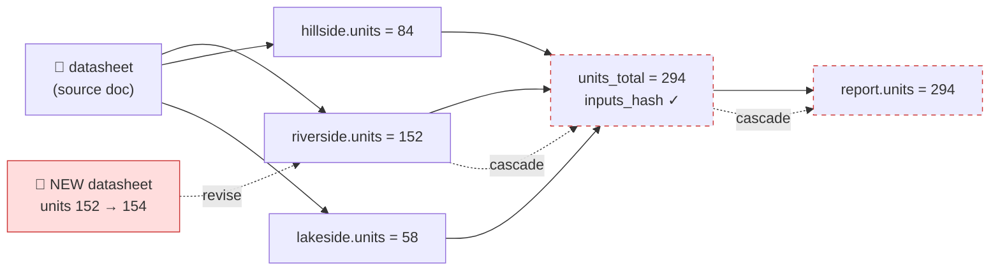

# provgraf

**A "bank of verified facts" for AI agents — a [W3C PROV](https://www.w3.org/TR/prov-overview/) knowledge graph on plain Postgres, with automatic staleness propagation.**

> ⚠️ **This is a proof-of-concept / engineering demo, not a supported product.** It was designed, evaluated and deployed for one real client engagement (anonymised here), and is published to document the idea and its implementation. Expect rough edges; issues are welcome, a roadmap is not promised.

## The problem

If you let an AI agent write client-facing documents, the model is not the risk — **the facts are**. A language model will happily "correct" a true, contract-grade number (a rent rate, a buyout rule, a share-capital figure) toward whatever the internet believes. In our real deployment, an overnight agent once tried to fix six verified facts to match plausible-but-wrong public sources.

Not every certain fact arrives as a PDF. Plenty of what you are told is true and consequential — a director confirms on a call how a scheme works, and you act on it. People also change their minds. So a source here is either a document with a file, or a **testimony**: a dated, attributed record that on this day this person vouched for this. That is what lets you stop relitigating a settled question, and it is why the integrity check differs by shape rather than demanding a file for everything.

There is a second, more mundane version of the same problem. An agent left to its own devices **dumps everything into Markdown files as it goes** — notes, half-verified numbers, copies of copies — with no validation at the door. If you're disciplined about your files, maybe you can live with that. If you're messy (I am), the workspace silently rots: three files disagree about the same number and none of them says where it came from. That was the actual trigger for building this.

provgraf is the counter-measure: a small database of **atomic facts, each with provenance** (which official document it came from, who put it there, when), plus one mechanism you don't get from a notes file:

**Change a source → the system tells you everything downstream that just went stale.**

It cuts both ways: the validating write path keeps the human's workspace from rotting, and the read-only agent surface keeps the agent honest — it can quote the bank, but it can't quietly "improve" it.

## The idea in 60 seconds

- Facts are nodes (`entity`), sources are nodes, people/software are `agent`s, decisions are `activity`s — [W3C PROV](https://www.w3.org/TR/prov-dm/) core plus documented extensions (`provenance_class`, `entity_status`; PROV sanctions extension via `prov:type` subtyping).
- Derived facts (sums, report figures) link to their inputs via `wasDerivedFrom` and store an `inputs_hash` of the input values.
- When a source fact is revised, a recursive SQL CTE walks the derivation graph and flags every transitively dependent fact as **stale** (measured: a 2-level cascade in ~2.5 ms).
- Versioning is a single trick: `valid_to` + a partial unique index (`WHERE valid_to IS NULL`). That gives **as-of queries** over the bank's own history for free.
- The bank is **bitemporal**: `valid_from/valid_to` is transaction time (what the bank believed when), `world_valid_from/world_valid_to` is world time (when the fact holds per its source). Only both axes together answer *"per what we knew on 15 June, what was in force in May"* — the question a backdated correction creates. The four-timestamp model is borrowed from [Graphiti](https://github.com/getzep/graphiti).
- Contradictory sources coexist as `disputed` alternates; a human resolves them with a recorded decision (the rejected alternative stays in the graph as a trail).
- No triplestore, no graph database. Postgres gives constraints, transactions, `pg_dump`, and a recursive CTE is all the graph traversal this problem needs.



## What's implemented

| Layer | What it does |
|---|---|
| **Core graph** | CLI (`typer` + `asyncpg`): `add`, `derive`, `revise`, `link`, `check`, `conflicts`, `resolve`, `subgraph`, `diagram` (Mermaid), `snapshot` |
| **Staleness engine** | `inputs_hash` + recursive CTE cascade; the hash is computed **identically in Python and SQL** (`hashing.py` ↔ `03_staleness_fns.sql`, parity is unit-tested, down to `COLLATE "C"` sort order) |
| **Integrity invariants** | No fact without provenance, no cross-client derivation, DAG guard (cycle rejection), duplicate detection — enforced in the database, they actually block |
| **Bitemporal versioning** | transaction time (`valid_from/valid_to`) + world time (`world_valid_*`); `get <qname> --at … --world-at …`, `--history` |
| **Conflicts & decisions** | `disputed` alternates → human `resolve` with recorded basis; recency-based suggestions are a *hint*, never auto-applied |
| **Binding layer** | `prov:Collection` nodes + `hadMember` from a per-client `config/structure.json`; open structural questions as first-class nodes with a resolution path |
| **Semantic search (RAG)** | Local `sentence-transformers` embeddings + a cross-encoder reranker; retrieval glosses are **auto-generated from a field dictionary** (`config/gloss.json`) — contextual retrieval without hand-writing descriptions. Provenance is deliberately excluded from the embedded text (it blurred the vectors). |
| **MCP server** | Read-only tools for AI agents (`list_facts`, `get_fact`, `search`, `precedents`, `check`) over stdio or SSE; lazy model loading + idle unload. **Writes stay CLI-only** — the architecture, not a prompt, enforces "no fact enters the bank without a human OK". |
| **Agent write gating** | Even on the CLI, a revision made by an agent of `kind='software'` lands as `to_confirm` until a human runs `verify`. An agent may propose; it cannot silently change a verified number. |
| **Shared-source guard** | `check` separates a missing source document from **ORPHANED** facts — those whose *only* source is that document. Facts backed by another live source are not flagged. |
| **Re-runnable writes** | `add`, `add-doc` and `revise` take `--skip-existing`, so a rebuild script can be run twice without hitting the unique index — and idempotence is per *entity*, not per script block, because a guard around a whole block silently swallows anything added to it later. |
| **Two shapes of a certain source** | A file-backed document (resolution, permit, registry extract) is verified by the file still being there. A **testimony** — someone competent vouched for it on a call — has no file by design; what makes it a record is *who* and *when*, and `check` flags a testimony missing either. |
| **Interop** | PROV-JSON export round-trips through the reference W3C [`prov`](https://github.com/trungdong/prov) library — covered by `tests/test_prov_export.py`, not just claimed |
| **Dashboard** | Streamlit view: facts, graph, documents, gaps |
| **One report, two renderers** | `report.gather()` computes `check` once; the CLI paints it and the MCP server serialises it. The human and the agent cannot end up looking at different states of the same bank. |

## How it was evaluated (the part that mattered)

The build was gated, not vibes-driven:

1. **PRD first**, reviewed by a panel of independent AI reviewer agents; their objections (e.g. "at ~30 facts Postgres barely beats a JSON file") were recorded as open tensions, not deleted.
2. **A 1-day spike on flat files** to prove the staleness-cascade design before writing any DDL.
3. **A go/no-go milestone** on real data: cascade correctness, version windows, invariants that actually reject bad writes, hash parity Python↔SQL.
4. **Standards check**: the PROV-JSON export deserializes cleanly with the reference W3C library, enforced by a test. Scope stated honestly: that proves the serialization is well-formed PROV-JSON, **not** PROV-CONSTRAINTS conformance (typing, causality loops, provenance travelling backwards in time), which needs a validator we have not run.
5. In production the bank grew to ~150 facts from 22 source documents and was used to fill investor-facing and grant documents, with a validator that blocks any hard number lacking a bank qname tag.

## Quickstart (demo)

Requirements: Docker, [`uv`](https://docs.astral.sh/uv/).

```bash
docker compose -f infra/postgres/docker-compose.yml up -d --wait
uv run provgraf init
uv run pytest                      # 27 tests: hash parity, invariants, cascade, as-of, conflicts
bash examples/demo_cascade.sh      # seed a fictional company → check → revise a source → watch the cascade
```

(Run the tests before the demo — they read global `check` state, so a seeded database makes two of them fail. `examples/reset.sh` wipes and re-seeds; it connects through `DATABASE_URL` and refuses to touch a database holding anything other than the demo owner.)

The demo seeds a fictional social-housing company ("Acme Community Housing"), builds a 2-level derivation chain, plants a source conflict and an overdue fact, then revises one source number and shows `check` flagging the transitively dependent facts. It closes on the bitemporal query: a rent recorded today but in force since 1 June answers for June and correctly finds nothing in force in May.

Optional extras:

```bash
uv sync --group rag                # local embeddings + reranker (configure models in .env)
uv run provgraf embed acme-housing && uv run provgraf search "how much is the rent"
uv run --group dashboard streamlit run dashboard/app.py
uv run --group mcp provgraf-mcp    # read-only MCP server for AI agents
```

The default embedding/reranker models in `.env.example` are Polish (`sdadas/mmlw-retrieval-roberta-large`, `sdadas/polish-reranker-large-ranknet`) because the original deployment was Polish-language; swap them for any `sentence-transformers`-compatible pair.

## Design decisions worth stealing

- **Boring storage was the right call — and historically the norm.** PROV is a data model, not a technology choice, and most *deployed* provenance recorders (Karma, Komadu, the IVOA provenance store) were relational too. Postgres gives constraints, transactions and `pg_dump`; a recursive CTE is all the graph traversal this problem needs. Presenting "PROV without a graph database" as a discovery would be a tell that you hadn't read the field.
- **Hash parity enforced by tests.** The staleness hash exists in Python *and* in a SQL function; a unit test feeds both the same fixtures. Divergence = the whole staleness feature silently lies.
- **Read/write asymmetry for agents.** Agents get a read-only MCP surface; writes go through a validating CLI with a human in the loop. Prompts can't enforce this — architecture can.
- **Auto-glosses for retrieval.** One dictionary entry per field type generates the embedded description for every fact of that type. New field → one JSON entry, not N hand-written descriptions.
- **Decisions are nodes.** Resolving a conflict creates an activity with an agent and a basis; `precedents` searches past decisions before you resolve a new dilemma.

## Prior art, and what is actually different

Before publishing this I ran a prior-art survey across ~20 systems. Every ingredient here exists somewhere; the assembly is what does not. Being specific about that is more useful than a novelty claim:

- **[Graphiti](https://github.com/getzep/graphiti) / Zep** — the closest neighbour and the one that beat us on an axis: genuine bitemporality with four timestamps per edge (which is why provgraf now has it). It has per-fact provenance back to the ingested episode. What it does not have is a staleness cascade — and its conflict handling is the mirror image of this project's: a small LLM decides at write time which contradicting fact loses and silently expires it, and its MCP surface hands the agent `add_memory`, `delete_entity_edge` and `clear_graph`.
- **[Dagster](https://docs.dagster.io/guides/build/assets/asset-versioning-and-caching)** — hashes code and input data versions to mark downstream assets stale. That *is* `inputs_hash` + cascade, shipping and battle-tested, at the granularity of assets and tables. provgraf's difference is the unit (one number, with a citation) and the human in the loop, not the mechanism.
- **Truth maintenance systems** (Doyle 1979, de Kleer 1986) and **content-addressed build systems** (Nix, Bazel) are the real ancestors of justification-plus-invalidation. Nothing here is new under the sun; it is applied to facts instead of beliefs or build artifacts.
- **[TrustGraph](https://github.com/trustgraph-ai/trustgraph)** — real `prov:` vocabulary in shipped code and a provenance CLI. Instructive twice over: it wrote this project's staleness feature down as a motivating use case and never built it, and it deliberately retreated from per-triple provenance to per-chunk containment because reification got expensive.
- **WhyHow.AI** — shipped per-triple → chunk → page-offset provenance back in 2024. The repositories have been untouched since, and the domain no longer resolves. Building this is demonstrably possible and demonstrably not sufficient on its own.
- **Knowledge-base tools** (Notion, Guru, Slab, Slite, Document360, GitBook) — verification exists, but the trigger is a calendar interval or an LLM judging that a document drifted from a connected source, and the unit is a page or a card. None of them holds a typed number, and none computes transitive dependents of a changed input. The industry is converging on probabilistic drift detection with accept/dismiss; the cascade here is deterministic and replayable. (Guru's "an edit by a non-owner unverifies the card" is where this project's agent gating comes from.)
- **Agent memory** (Mem0, Letta, LlamaIndex, LangMem, Google Memory Bank) — contradiction is resolved by overwriting or deleting, decided by a model. Mem0's prompt says it outright: *if the retrieved facts contradict the memory, delete it*. Coexisting disputed alternates plus a recorded human decision with a basis appears nowhere in that category.
- **Not** database provenance in the Green–Karvounarakis–Tannen sense (ProvSQL, GProM). That field annotates query results with semiring lineage; this is retrospective/workflow provenance. Different camp, easy to confuse.

Uncontested, as far as the survey found: **fact-level staleness propagation**, and **conflicts that survive as alternates until a human records a decision**. Everything else in the list above is prior art we are standing on.

## Known limitations

Honest list (an adversarial code review ran before publishing; the notable leftovers):

- Clean PROV-JSON deserialization is tested; PROV-CONSTRAINTS conformance is not checked.
- No incremental recomputation: the cascade tells you what went stale, it does not recompute derived values for you.
- Single-user by design: no auth, no concurrency story beyond Postgres transactions.
- No `rm-doc`: documents are never deleted, only reported as dangling (with the orphaned facts they would take down).

## Not built (on purpose)

- **Query-time provenance** — recording which facts fed a particular answer or document (TrustGraph does this). Likely belongs in the application consuming the bank rather than in the engine.
- **LLM-resolved contradictions and auto-repairing memory.** Both are well-trodden elsewhere and both defeat the point of a bank whose contents a human vouched for.

## License

MIT
